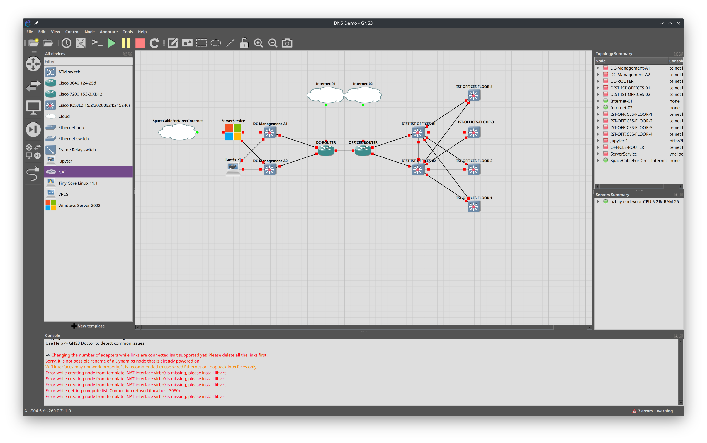

# Basic network setup for demo

Ths project of the basic network simulation and have following tasks.

## Tasks:

- DHCP server on Windows
- DNS server on Windows
- Office area:
  - Have four floor
  - Have two DIST switches
  - Split network of two areas (DC/Office)

# Network structure

Offices and manager for 172.16.0.0/12
Servers and IT computers for 192.168.0.0/16

## DC Subnets:

- Service computers:
  - VLAN 10
  - Name: SERVICE
  - Network: 192.168.10.0/25
- Automation (Jupyter, ansibler etc.)
  - VLAN 11
  - Name: CLOUD-SERVICES
  - Network: 192.168.10.128/25
- Other Servers etc.:
  - VLAN 12
  - NAME SERVER-NODES
  - Network 192.168.12.0/23

## Office Subnets:

- Staff network: 172.16.10.0/23
  - Sellers computers:
    - VLAN 110
    - Name: STAFF-SELLER
    - Network: 172.16.10.0/25
  - Callcenter computers:
    - VLAN 111
    - Name: STAFF-CALLC
    - Network: 172.16.10.128/25
  - Sellers IP Phone:
    - VLAN 150
    - Name: STAFF-SELLER
    - Network: 172.16.11.0/25
  - Callcenter IP Phone:
    - VLAN 151
    - Name: STAFF-CALLC
    - Network: 172.16.11.128/25
- IT network: 172.16.12.0/24
  - Staff:
    - VLAN 109
    - Name: STAFF-IT
    - Network: 172.16.12.0/25
  - Tools:
    - VLAN 108
    - Name: STAFF-IT-TOOLS
    - Network: 172.16.12.128/25
