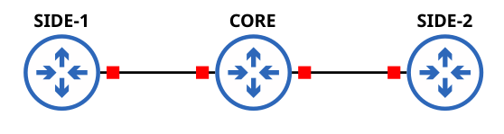

# Tek Alanlı (Single-Area) OSPF Yapılandırması



Bu yapılandırma, `one-area-ospf.ios` dosyasında bulunan komutları kullanarak üç yönlendirici (router) arasında temel bir OSPF komşuluğunun nasıl kurulacağını açıklar. Topoloji, bir merkez (CORE1) ve ona bağlı iki yan yönlendiriciden (SIDE1, SIDE2) oluşur.

## Topoloji ve IP Adreslemesi

Yapılandırma, aşağıdaki gibi bir yıldız (hub-and-spoke) topolojisi varsayar:

```
  SIDE1  <------>  CORE1  <------>  SIDE2
```

*   **CORE1 ile SIDE1 arası bağlantı:** `10.0.1.0/31` ağı kullanılır.
    *   `CORE1 (Eth0/0)`: `10.0.1.0`
    *   `SIDE1 (Eth0/0)`: `10.0.1.1`
*   **CORE1 ile SIDE2 arası bağlantı:** `10.0.2.0/31` ağı kullanılır.
    *   `CORE1 (Eth0/1)`: `10.0.2.0`
    *   `SIDE2 (Eth0/0)`: `10.0.2.1`

**Not:** Noktadan noktaya bağlantılar için `/31` (subnet mask `255.255.255.254`) kullanılmıştır. Bu, IP adresi israfını önleyen modern bir yaklaşımdır.

---

## Yönlendirici (Router) Yapılandırmaları

### 1. CORE1 Router

Merkez yönlendirici olarak görev yapar ve her iki yan yönlendiriciye de bağlıdır.

```ios
configure terminal
    ! SIDE1'e giden arayüz
    interface Eth0/0
        ip address 10.0.1.0 255.255.255.254
        no shut
        exit
    ! SIDE2'ye giden arayüz
    interface Eth0/1
        ip address 10.0.2.0 255.255.255.254
        no shut
        exit
    
    ! OSPF yapılandırması
    router ospf 1
        network 10.0.0.0 0.0.3.255 area 0
```

### 2. SIDE1 Router

Bu yönlendirici, CORE1'e `Eth0/0` arayüzü üzerinden bağlanır.

```ios
configure terminal
    interface Eth0/0
        ip address 10.0.1.1 255.255.255.254
        no shut
        exit
    router ospf 1
        network 10.0.0.0 0.0.3.255 area 0
```

### 3. SIDE2 Router

Bu yönlendirici, CORE1'e `Eth0/0` arayüzü üzerinden bağlanır.

```ios
configure terminal
    interface Eth0/0
        ip address 10.0.2.1 255.255.255.254
        no shut
        exit
    router ospf 1
        network 10.0.0.0 0.0.3.255 area 0
```

## OSPF Yapılandırmasının Detayları

*   `router ospf 1`: Tüm yönlendiricilerde OSPF süreci (process ID 1) başlatılır. Bu ID'nin yönlendiriciler arasında aynı olması gerekmez, sadece yerel olarak anlamlıdır.
*   `network 10.0.0.0 0.0.3.255 area 0`: Bu komut, hangi arayüzlerin OSPF sürecine dahil edileceğini belirtir.
    *   `10.0.0.0` IP adresi ve `0.0.3.255` wildcard maskesi, `10.0.0.0` ile `10.0.3.255` arasındaki tüm IP adreslerini kapsar.
    *   Bu aralık, yapılandırılan tüm arayüzleri (`10.0.1.x` ve `10.0.2.x`) içerdiği için, bu arayüzlerde OSPF aktif hale gelir.
    *   `area 0`: Tüm arayüzler OSPF'in ana alanı olan "backbone area" (Area 0) içine dahil edilir. Bu, basit bir tek alanlı OSPF ağı oluşturur.
