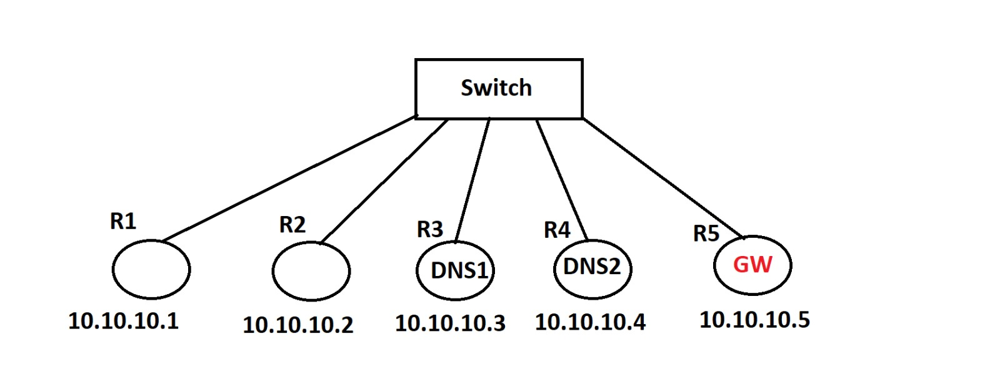

# 2. hafta network sorusu


1. Tüm router'lara aynı blok IP verilecek , ve hepsi birbirine ping atabiliyor olduktan sonra ; Aşağıdaki işlemler uygulanacak.

2. R1 ve R2 aynı vlan'da olsun , fakat birbirleri ile haberleşemesin. R1 ve R2 R3,R4 ile de haberleşemesin ( ACL Olmadan Yapılacak )

3. R1 ve R2 R5 ile haberleşsin ( Çünkü R5 beni internete çıkaracak bir gateway olsun ) ( ACL Olmadan Yapılacak )

4. R3 ve R4 aynı vlanda olsun , birbileri ile haberleşsin , çünkü yedekli dns olsun bunlar , ama R1 ve R2 ile haberleşemesin. ( ACL Olmadan Yapılacak )

5. R3 ve R4 R5 ile haberleşsin ( Çünkü R5 beni internete çıkaracak bir gateway olsun ) ( ACL Olmadan Yapılacak )

6. Sadece R5 kaldı , anlaşılacağı üzere R5 Gateway olduğu için herkes ile haberleşsin.

> Haberleşsin = Ping Atabilsin
> Haberleşmesin = Ping Atamasın

---

Bonus Sorusu 1 ;
BPDU Filter'ı interface içine yazmak ile , global modda yazmak arasındaki fark nedir ? :) :)

---

Bonus Sorusu 2 ;

Switch üzerinde Vl 1006 oluşturulacak , isim verilecek. Sh vl çıktısında vl 1006 görülecek.
no vl 1006 yazılıp vl silinecek. sh vl çıktısında vl 1006 nın olmadığı görülecek.

Switch üzerinde herhangi bir porta no switchport yazılacak, port up duruma gelecek.
vl 1006 oluşturulacak.

Günün sonunda görmek istediğimiz tablo şu olacak ;
Herhangi bir interface no switchport durumdayken
vl 1006 oluşturulması.

---

Çözüm ;

1. Arp çıktısı R5 üzerinden (diğerleride aynı durumdadır. GW olduğu için sadece bunun çıktıyı ekledim.):

> Tüm cihazlara birbirlerine ping atmak yerine cihazda sadece `ping 10.10.10.255 repeat 1` ile yapılan broadcast ile hepsi alındı.

```
R5#show arp
Protocol  Address          Age (min)  Hardware Addr   Type   Interface
Internet  10.10.10.1              0   c001.1e9a.0000  ARPA   FastEthernet0/0
Internet  10.10.10.2              0   c002.1eec.0000  ARPA   FastEthernet0/0
Internet  10.10.10.3              0   c003.1f0a.0000  ARPA   FastEthernet0/0
Internet  10.10.10.4              0   c004.1f28.0000  ARPA   FastEthernet0/0
Internet  10.10.10.5              -   c005.1f4a.0000  ARPA   FastEthernet0/0
```

Ayarlar:

```
! R1
conf t
inter fa0/0
  no shut
  ip address 10.10.10.1 255.255.255.0
  end
wr
! R2
conf t
inter fa0/0
  no shut
  ip address 10.10.10.2 255.255.255.0
  end
wr
! R3
conf t
inter fa0/0
  no shut
  ip address 10.10.10.3 255.255.255.0
  end
wr
! R4
conf t
inter fa0/0
  no shut
  ip address 10.10.10.4 255.255.255.0
  end
wr
! R5
conf t
inter fa0/0
  no shut
  ip address 10.10.10.5 255.255.255.0
  end
wr
```

2. 